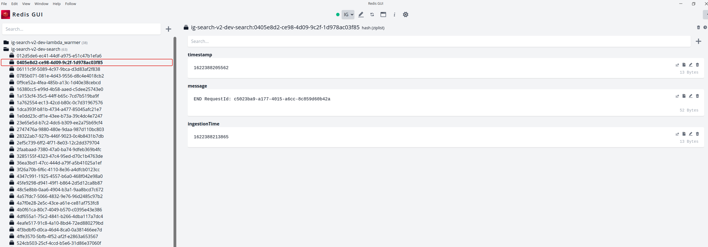

## ServerlessLogStreamer


## What is SLS? 
This repo is a serverless log project. So why did it appear? 
Cloudwatch was sounding so slow, I'm tired of it now. I didn't want to go into my constant aws account to do a simple text search.

## How to use it ? 

 - Create Redis Account on <a href= "https://redislabs.com">RedisLabs</a> (don't worry it's free)
 - Change .chalice/config.json with your keys
 - Deploy to project with your aws 
   - ```chalice deploy```
    
## Endpoints
 - https://lambda-url.amazonaws.com/api/search?text=<string>
   

 - https://lambda-url.amazonaws.com/api/<lambda-name>

## Environment Variables
     LABEL                  DESCRIPTION               TYPE    Requirement
     aws_access_key_id      AWS ACCESS KEY           string     YES
     aws_secret_access_key  AWS SECRET ACCESS KEY    string     YES
     aws_region_name        AWS REGION               string     YES
     redis_index_name       REDIS INDEX NAME         string     YES
     redis_host             REDIS HOST NAME          string     YES
     redis_port             REDIS PORT               string     YES
     redis_password         REDIS PASSWORD           string     YES
     slack_token            SLACK TOKEN              string      NO
     lambda_list            LAMBDA LIST              string     YES

### Example
    "redis_host":"r.cloud.redislabs.com",
    "redis_port":"1",
    "redis_password":"BM",
    "slack_token": "xoxb",
    "lambda_list" : "['lambda_1', 'lambda_2']"

#### Note
 - As you will notice, we gave lambda names in the list, although the field called lambda_list is string, this is because amazon wants all settings for config as string.
 - Schedule_lambda lambda run every 1 min. It's means every minute we record the logs of our lambda.
 - If we want other systems to listen to our logs, we can use the SubPub class in redis_connection.

#### Results
